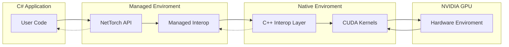

# DeepSharp

DeepSharp is a machine learning interop library bridging CUDA/C++ performance with C# simplicity.



## Quickstart

```csharp
using DeepSharp;

var a = new NativeMatrixFloat(2, 2);
var b = new NativeMatrixFloat(2, 2);
a.FillRandom(42);
b.FillRandom(42);
var c = NativeMatrixFloat.Multiply(a, b);
Console.WriteLine(c[0, 0]);
```

## Installation & Build

*TODO: Add instructions for building native and managed components.*

## Documentation

- [Introduction](docs/Introduction.md)
- [API Reference](docs/APIReference.md)
- [Getting Started](docs/GettingStarted.md)
- [Core Concepts](docs/CoreConcepts.md)
